Virtual Desktop in ARE 
-------------------------------------

.. admonition:: Overview
    :class: Overview

    **Tutorial:** 10 min

    **Objectives:**
        * Learn how to use Virtual Desktop in ARE. 

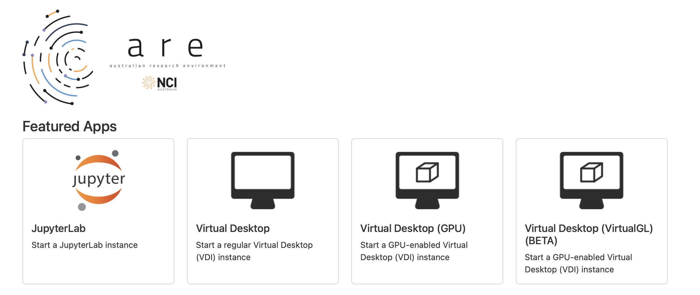

First, click on the `Virtual Desktop` tab in ARE.

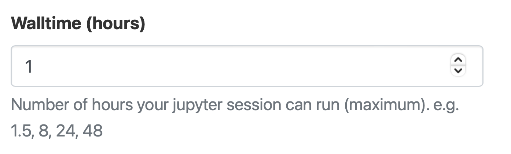

Specify how many hours you need the `Virtual Desktop`  for. 

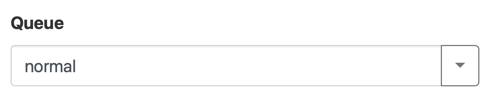

Specify the queue you need.

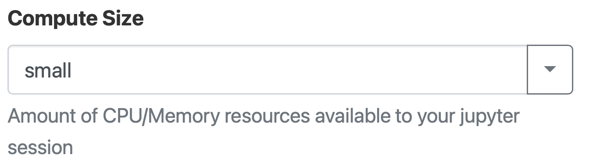

Specify the size of the compute (cores and memory).

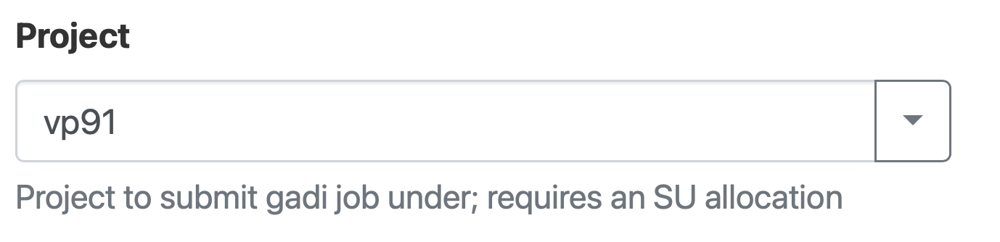

Specify the project you are going to use.

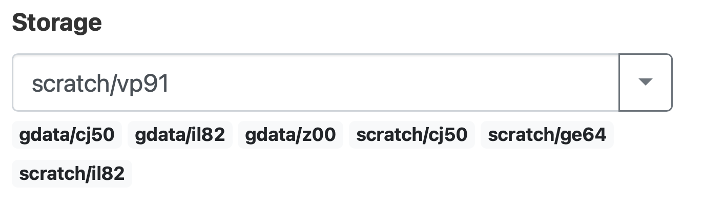

Specify the storage folder (not a necessary field).

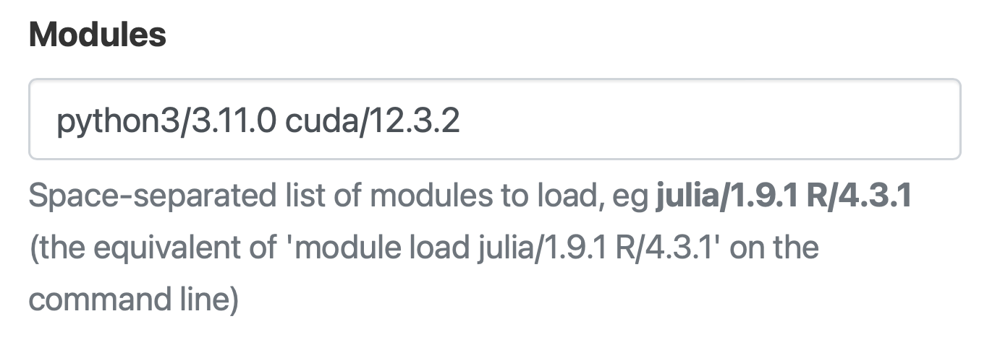

Specify all the modules you need (for your virtual environment).

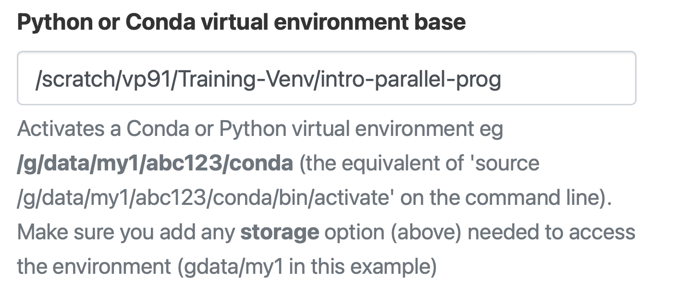

Specify the virtual environment you need. 

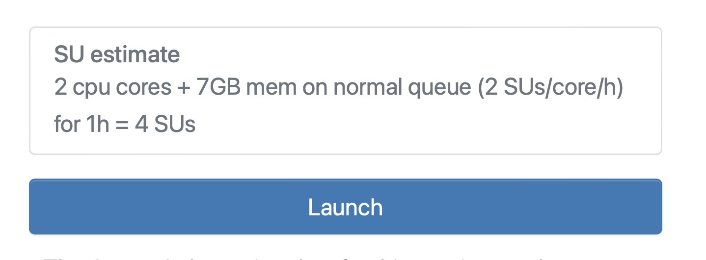

Launch the `Virtual Desktop` .

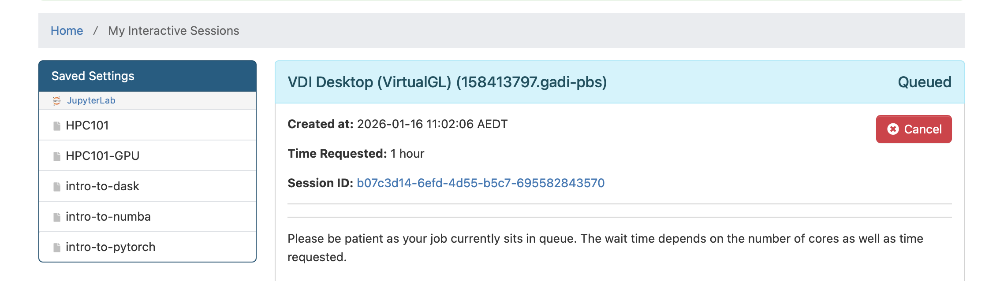

Wait for the job to start.

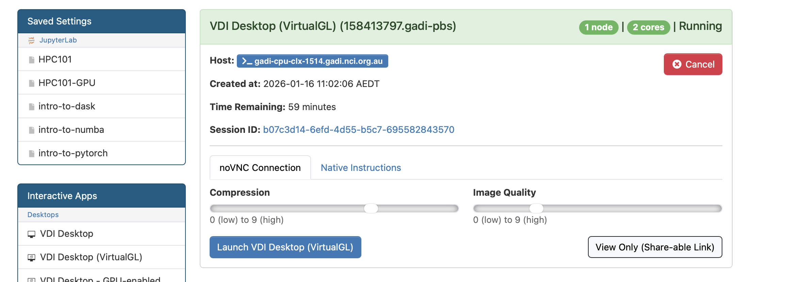

Once the job is granted you can access the Jupyter note by clicking on `Launch VDI Desktop`.

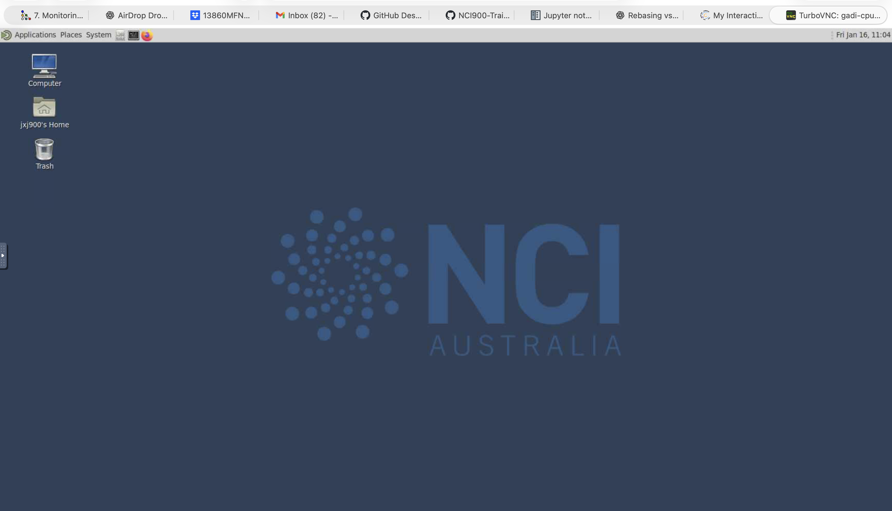

Finally, you will see the Virtual Desktop interface and you can access the terminal or anu other applications installed.

Requesting GPUs
****************

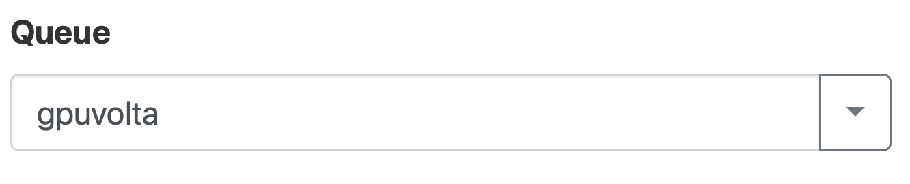

Use the queue ``gpuvolta`` for GPUs.

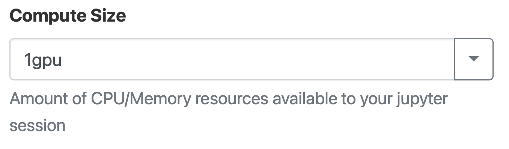

Select the number GPUs you need.

.. admonition:: Key Points
   :class: hint

    #. ARE makes using GUI based application easy on Gadi usig `Virtual Desktop`.

