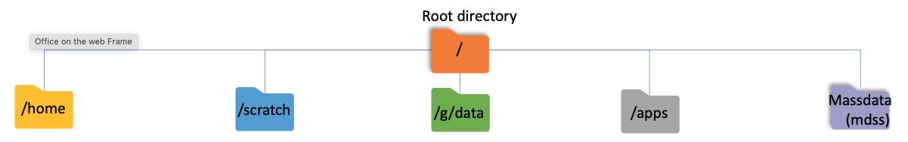
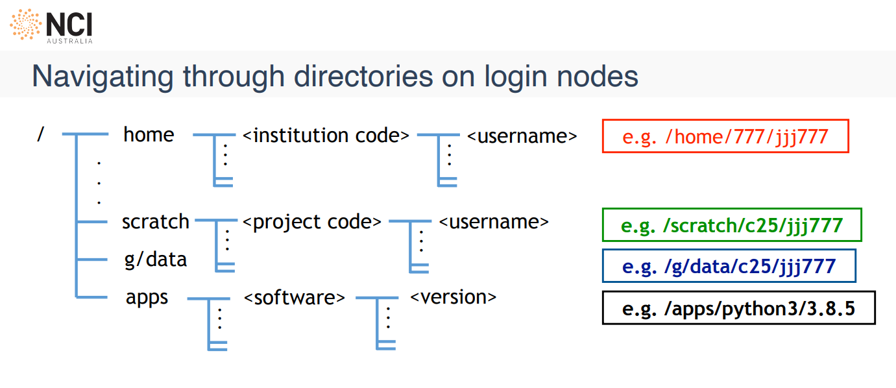

Navigating Gadi File System
--------------------

.. admonition:: Overview
    :class: Overview

    **Tutorial:** 30 min

    **Objectives:**
        * Learn how to use the Gadi terminal.
        * Learn how to navigate the filesystem.
        * Learn how to manage files and directories.
        * Learn how to copy files to and from Gadi.

    This page introduces essential commands to get you started on Gadi. For a more detailed guide, see the `Linux Command Quick Reference <https://opus.nci.org.au/spaces/Help/pages/230490891/Linux+Command+Quick+Reference...>`_.
    If you are completely new to Linux, we recommend you to go over the `The Unix Shell <https://swcarpentry.github.io/shell-novice/index.html>`_ first.

Gadi File System
*****************

-----------

.. list-table:: **Gadi File System Overview**
   :widths: 15 20 20 45
   :header-rows: 1

   * - Location
     - Purpose
     - Backup / Quota
     - Notes
   * - **/home**
     - Personal user space
     - Backed up  
       10 GiB per user
     - Store important and hard-to-reproduce files. Meant for config and critical content only.
   * - **/scratch**
     - Project space, high performance
     - Not backed up  
       Project quota  
       100 days expiry
     - Fastest storage. Temporary: files deleted after 100 days of no access. Use for raw experimental output.
   * - **/g/data**
     - Permanent long-term project space
     - Not backed up (unless mirrored)  
       Project quota
     - Store large datasets, input/output, code. Managed by institution/scheme. Persistent storage for research.
   * - **/apps**
     - Centrally provided software
     - Managed by NCI  
       Read-only
     - Contains installed software modules and applications for all users.
   * - **/mdss**
     - Archival, backed-up storage
     - Backed up  
       Managed by scheme
     - Uses magnetic tape. For archiving important files requiring infrequent access.

.. admonition:: Knowledge Check 1: The Storage Dilemma
    :class: attention

    **Scenario:**  
    You have a 500GB dataset that you need to analyze over the next three days. You plan to run 10 different jobs against this data.

    **Question:**  
    Which file system should you store the data in while the jobs are running, and why?

    **A)** `/home`: Because it is the most secure.

    **B)** `/scratch`: Because it is high-speed and designed for large-scale temporary processing.

    **C)** `/g/data`: Because it is where my project is hosted.

    .. dropdown:: Show answer

        **Answer:**  
        **B) /scratch.** While `/g/data` is great for long-term storage, `/scratch` is optimized for the high-speed I/O (Input/Output) required during active job execution. Just remember to move your results back to `/g/data` when done!

Understanding your location (`pwd`)
***********************************

Your *current directory* is where terminal commands run. ``pwd`` (*print working directory*) shows its full path.

.. code-block:: bash

    pwd

Listing files (`ls`)
********************

General syntax of a command:

.. image:: ../figs/shell_command_syntax.svg
    :width: 40%
    :align: center

``ls`` lists files and folders in the current directory.

Detailed list view with permissions, size, and timestamps:

.. code-block:: bash

    ls -l

Human-readable sizes (easier when checking large files):

.. code-block:: bash

    ls -lh

Show hidden files (names starting with ``.``):

.. code-block:: bash

    ls -a

.. admonition:: Hint
    :class: hint

    Use ``ls --help`` anytime you need option names and short descriptions.

Practice: Find your bearings
**************************

.. admonition:: Exercise
    :class: attention

    * Find out what directory you are in and list the files and directories there.
    * Then list contents with sizes in a human-readable form, sorted by size.
      Hint: check ``ls --help`` for sorting options.

    .. dropdown:: See solution

       .. code-block:: bash

          pwd
          ls
          cd /scratch/vp91/$USER
          ls -lhS

Changing directory (`cd`)
*************************

Move to an absolute path:

.. code-block:: bash

    cd /path/to/directory

Go up one level:

.. code-block:: bash

    cd ..

Jump to your home directory:

.. code-block:: bash

    cd ~

Practice: Explore shared locations
********************************

.. admonition:: Exercise
    :class: attention

    * Go to ``/scratch/vp91/$USER`` and see where it is.
    * In separate visits (``cd``, ``ls``, then ``cd`` somewhere else), look at what is under ``/apps``, ``/scratch``, and ``/g/data``. These are important areas on Gadi; you don’t need to understand everything yet—just get a sense of how they’re laid out.
    * Find out the latest version of python3 available in ``/apps``. How would you sort the files to find the latest version?

    .. dropdown:: See solution

       .. code-block:: bash

          cd /scratch/vp91/$USER
          pwd
          ls
          cd /apps
          ls 
          ls -lht /apps/python3

Managing files and directories
*********************************

``mkdir``: create a directory

.. code-block:: bash

    mkdir test

``touch``: create an empty file (or update a file’s timestamp if it exists)

.. code-block:: bash

    touch test.txt

``rm``: delete files (**no “rubbish bin”** on the cluster — see the warning below).

Remove one file:

.. code-block:: bash

    rm test.txt

Remove a directory and everything inside (**use carefully**):

.. code-block:: bash

    rm -rf test

``cp``: copy files or directories

Copy ``file1`` to ``file2``:

.. code-block:: bash

    touch file1.txt
    cp file1.txt file2.txt

Copy a directory recursively:

.. code-block:: bash

    mkdir dir1
    cp -r dir1 dir2

``mv``: move or rename files and directories.

Rename file:

.. code-block:: bash

    mv file1.txt renamed.txt

Move a directory inside another directory:

.. code-block:: bash

    mv dir1 dir2

.. admonition:: Delete with caution
    :class: danger

    There is no Trash folder to restore from once a file is removed. Backup tools exist, but rely on backups you made yourself — there is no guarantee of recovery here. Prefer ``rm`` on copies or test folders until you’re confident.

Viewing and editing text
************************

``cat``: print whole file contents to the terminal:

.. code-block:: bash

    cat file.txt

``less``: scroll through a large file interactively (press ``q`` to quit):

.. code-block:: bash

    less file.txt

``nano``: simple terminal editor:

.. code-block:: bash

    nano file.txt

``vim``: more powerful modal editor:

.. code-block:: bash

    vim file.txt

Practice: Create, inspect, tidy up
********************************

.. admonition:: Exercise
    :class: attention

    Under ``/scratch/vp91/$USER``:

    * Create a directory called ``hello_world``.
    * Create a file ``hello_world/hello_world.txt`` and put ``Hello, World!`` inside it (your editor choice, or redirect from ``echo`` if you prefer).
    * Display the contents in the terminal, then delete the file and folder when you’re done.

    .. dropdown:: See solution

       .. code-block:: bash

          cd /scratch/vp91/$USER
          mkdir hello_world
          # or using nano, vim, or another editor: 
          # nano hello_world/hello_world.txt
          echo "Hello, World!" > hello_world/hello_world.txt
          cat hello_world/hello_world.txt
          rm -rf hello_world

Copying files to and from Gadi (`scp`)
***************************************

``scp`` copies files over SSH—useful for moving scripts or outputs between your laptop and Gadi.

Copy **from** your computer **to** Gadi:

.. code-block:: bash

    scp local_file YOUR_USERNAME@gadi.nci.org.au:/remote/path/

Copy **from** Gadi **to** your current local folder:

.. code-block:: bash

    scp YOUR_USERNAME@gadi.nci.org.au:/remote/path/file .

Practice: Prepare the code for your first job on Gadi
**************************************************

.. admonition:: Exercise
    :class: attention

    #. Create ``/scratch/vp91/$USER/first_job``.
    #. Save `hello_mpi.c <https://opus.nci.org.au/download/attachments/241927319/hello_mpi.c?version=1&modificationDate=1694580944667&api=v2>`_ onto your laptop, then upload it into ``first_job`` with ``scp`` (adjust paths and username to match yours).

