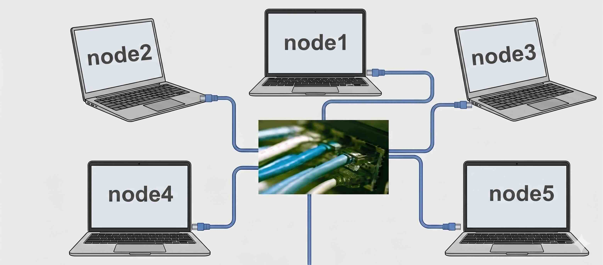
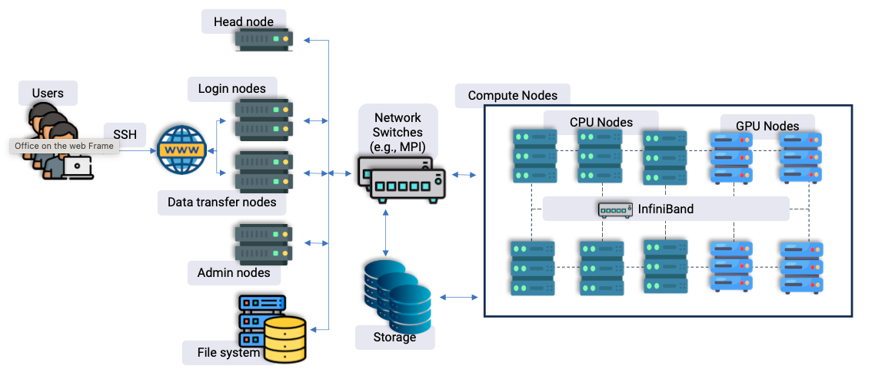
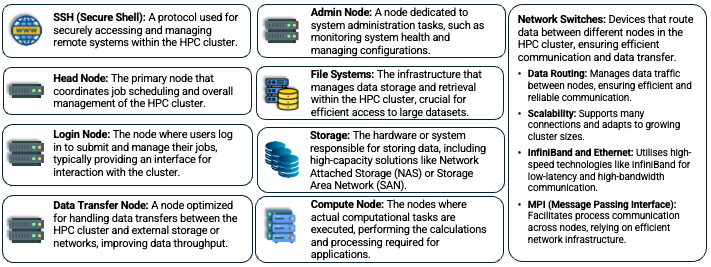
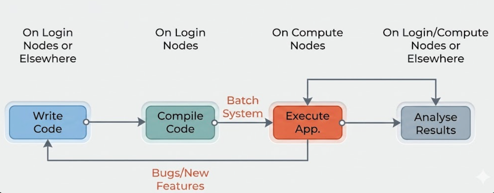
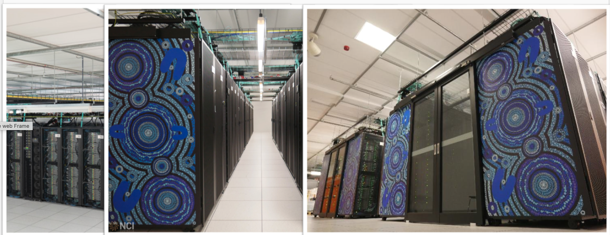

Introduction to HPC, NCI and Gadi
---------------------------------

.. admonition:: Overview
    :class: Overview

    **Tutorial:** 20 min

    **Objectives:**
        * Learn the general design of an HPC machine.
        * Learn how Gadi is organised.

Why HPC?
^^^^^^^^

#. Running large-scale tasks like cross-validating statistical models multiple times (e.g., 1000+ runs).
#. Handling massive data sets, such as genomic sequencing, which would overwhelm local computers.
#. Training machine learning algorithms that demand high computational power and memory.
#. Performing tasks beyond the capability of standard PCs, including simulations, numerical calculations, and computer modeling.

What is HPC?
^^^^^^^^^^^^^

High-performance computing (HPC) involves using clusters of powerful processors working in parallel to process large datasets and perform complex 
calculations at extremely high speeds. 

HPC performance is measured in terms of **floating point operations per second** (FLOPS). A FLOP is essentially one simple math calculation, like 1.525634 * 2.5874239.

Modern supercomputers are measured in petaflops. A petaflops is 10^15 FLOPS, meaning it can perform 10^15 floating point operations per second.

Gadi is Australia's fastest CPU-based research supercomputer, delivering more than 10 petaflops of peak performance, which equates to over ten quadrillion (10¹⁵) floating point operations per second.

How is it achieved?

HPC Architecture
~~~~~~~~~~~~~~~~~

We can think of it as multiple laptops connected together by high-speed network and the users have access to more computational resources.

Each laptop stands for a compute node, so here we have 5 compute nodes.
If each laptop has 2 processors, each processor has 4 cores, then this cluster has 40 cores. Gadi contains more than 260,000 CPU cores, 1.25 petabytes of memory and 776 GPUs.

An HPC cluster is made up of hundreds or thousands of compute nodes, that are networked together to work in parallel, significantly 
increasing processing speed. (Only when the program is coded to do parallel computing! The HPC **will not** automatically run all code in parallel.)

Key features:

#. Each node contains multiple processors, ranging from 8 to 64 cores.
#. Nodes are connected via a high-speed network, such as InfiniBand.
#. The system is typically Linux-based.

Other than the compute nodes, there are also other components in an HPC cluster.

----------------------------------------------------------------------------------------------------

**Comparing Computer Architectures**

.. list-table::
   :widths: 20 80
   :header-rows: 1

   * - System Type
     - Description & Example Image
   * - Desktops, Laptops, and Workstations
     - .. image:: ../figs/arch1.png
          :width: 50%
       
       Individual computers for general or professional use.
   * - **High Performance Computing (HPC) Clusters**
     - .. image:: ../figs/arch4.png
          :width: 100%

       Powerful clusters networked together for parallel processing and complex computations.
   * - Servers (Cloud Servers)
     - .. image:: ../figs/arch2.png
            :width: 80%

       Centralized servers used for hosting cloud services and resources.

Differences from Desktop Computing
^^^^^^^^^^^^^^^^^^^^^^^^^^^^^^^^^^^

- Not a GUI-based system, but a command-line interface.
- Users interact with the system as follows:
    - Log in to login nodes.
    - Submit jobs to the compute nodes via a job scheduler (e.g., PBS, SLURM).
    - Jobs are placed in a queue and run later on the compute nodes.
- Compute nodes:
    - Are not connected to the internet.
    - Cannot download data/packages on the fly.
    - Job output may be saved to the file system.
    - Users return later to check results.
- Shared system with many users:
    - Need to be careful with resource usage and avoid overloading the system.
    - Users do not have admin access, so installing software themselves is not allowed.
    - Use of the ``sudo`` command is recorded and flagged (double-check before pasting commands from the internet!).
    - Set correct permissions for files and directories.
    - ...

Gadi
^^^^

**Meet Gadi: One of Australia's Premier HPC Facilities**

*Photo: Gadi servers at NCI*

Gadi is Australia's fastest CPU-based research supercomputer, delivering more than 10 petaflops of peak performance, which equates to over ten quadrillion (10¹⁵) floating point operations per second. 

Key specifications:

- 4997+ compute node servers
- Over 250,000 compute cores (including Intel Sapphire Rapids, Cascade Lake, Skylake, Broadwell, and NVIDIA V100, DGX A100)
- 930 terabytes of memory
- 200 Gb/s InfiniBand HDR network

Gadi debuted as the 24th fastest supercomputer in the world and is currently ranked 201.
