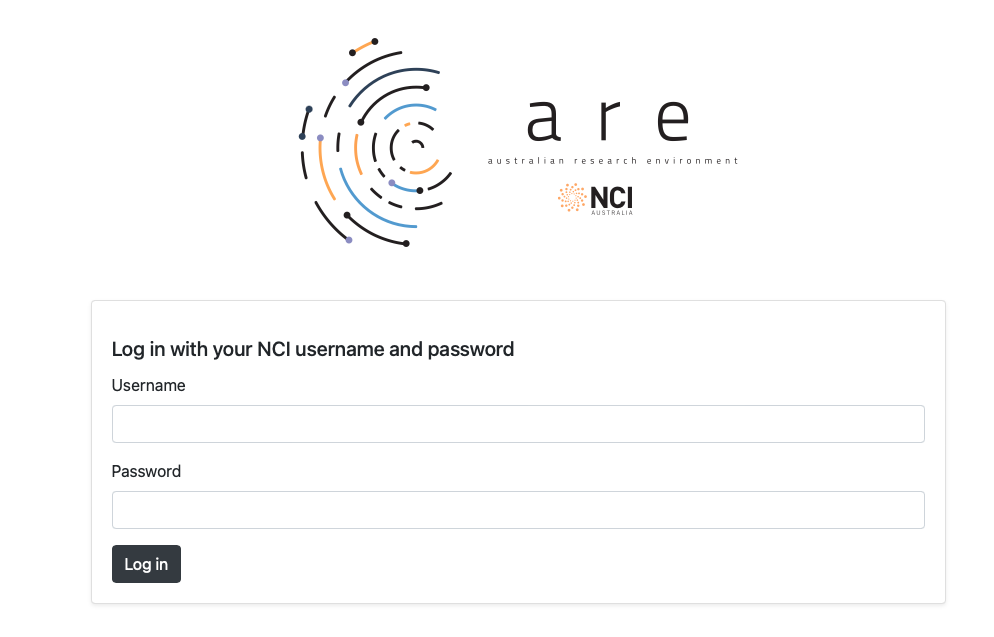
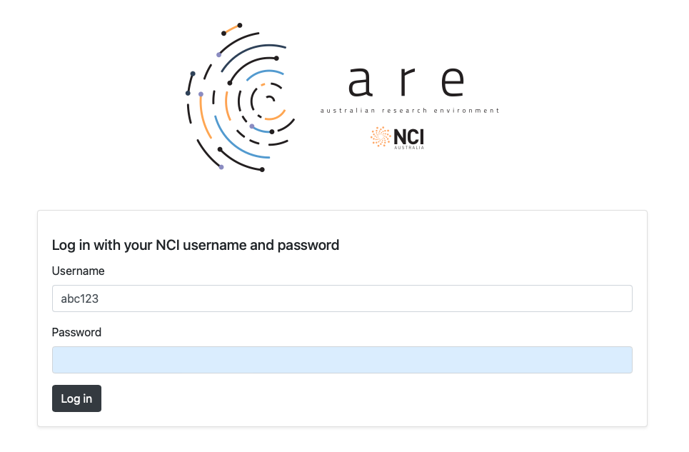
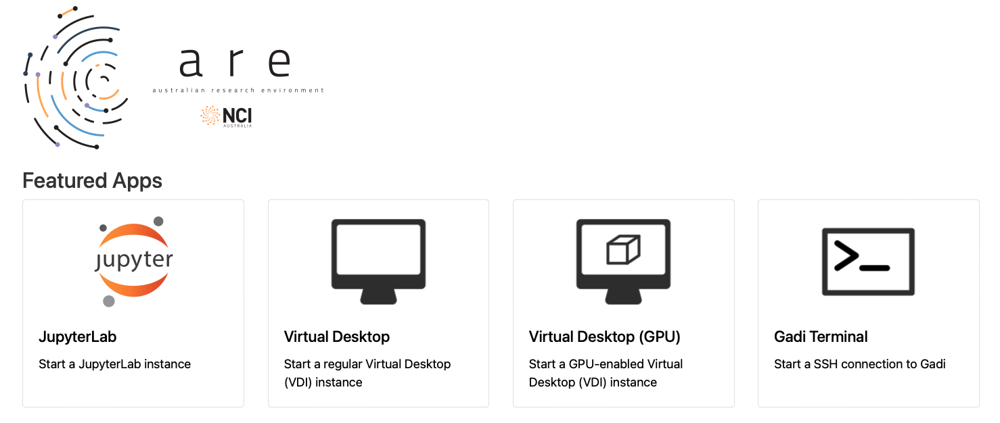
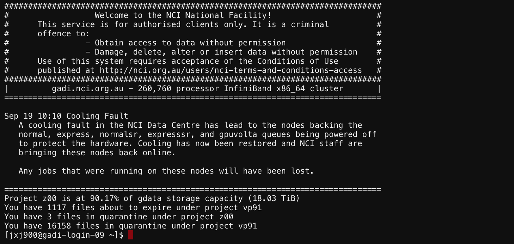

Logging in to Gadi
-------------------------------------

.. admonition:: Overview
    :class: Overview

    **Tutorial:** 10 min

    **Objectives:**
        * Learn how to use Gadi terminal in ARE. 

To access Gadi, you must first create an NCI account and be affiliated with a project. Projects are 
typically allocated through either the National Computational Merit Allocation Scheme or 
stakeholder allocations. If you have not yet completed this process, our *Getting Started at NCI* guide provides step-by-step instructions to help you get started.

By Australian Research Environment (ARE)
******************************************

Us the link - http://are.nci.org.au to login to Australian Research Environment (ARE). 

You should use your NCI username (not your email) and your NCI password to login. 

From the landing page select **Gadi Terminal**. 

Now you should have access to a terminal on Gadi. 

Practice: Login to ARE and open a terminal
*******************************************

.. admonition:: Exercise
    :class: attention

    #. Login to ARE at `http://are.nci.org.au/ <http://are.nci.org.au/>`_ using your NCI username and password.
    #. Check out the tool bar items and what they do.
    #. From the landing page select **Gadi Terminal**.
    #. You should have access to a terminal on Gadi.
    #. Check the terminal prompt.

By Terminal
***********

The first step is to assess what operating system you are using, as that will change how you log into Gadi. Mac and Linux users will be able to use the built-in terminal to access Gadi, however windows users will need to download a 3rd party application, MobaXterm. 

.. tab-set::

   .. tab-item:: Mac

      Mac users can open Terminal by clicking the **Launchpad** icon in the dock, typing "terminal" in the search bar, and then clicking on the Terminal icon to open it.

      Alternatively, press ``Command + Space bar``, type "terminal", and select the Terminal app when it appears.

   .. tab-item:: Linux

      Linux users can open Terminal from the **Applications menu** by locating and clicking on the terminal icon.

      Alternatively, press ``Ctrl + Alt + T`` to open a terminal using the keyboard shortcut.

   .. tab-item:: Windows

      Windows users can use PowerShell to perform an SSH login.
      **OR** 
      Download and install **MobaXterm** from https://mobaxterm.mobatek.net/. This application will serve as your SSH client to access Gadi.

      A quick guide to using MobaXterm is available to help you get started. Please follow the guide before continuing with this walkthrough.

 
Once you have an open terminal, you can connect to Gadi using the command line, 

.. code-block:: bash

    ssh <username>@gadi.nci.org.au

Replacing <username> with your MyNCI user name. e.g. aaa777, then enter your password.

.. note::

   When typing your password, nothing will appear on the screen, but key strokes are recorded as normal.
   
   This is normal behavior for Linux-based systems. Simply type your password and press Enter.

**Using Graphical Tools**

#. Run an X server on your local system, such as **XQuartz** on Mac, **startx** on Linux, or **MobaXterm** on windows  

#. Login to Gadi using ``ssh -Y <username>@gadi.nci.org.au``. 

   The ``-Y`` enables forwarding of trusted X protocol messages between your X-Server and Gadi's X programs, allowing you to use graphical applications on Gadi.

#. Test the connection by running ``xclock`` or ``xeyes``. These are simple X programs that display a clock or eyes, respectively.

For more information on using graphical tools to access Gadi, please refer to the `NCI Documentation <https://opus.nci.org.au/spaces/Help/pages/230491359/Connecting+to+Gadi...#ConnectingtoGadi...-GraphicalTools>`_.